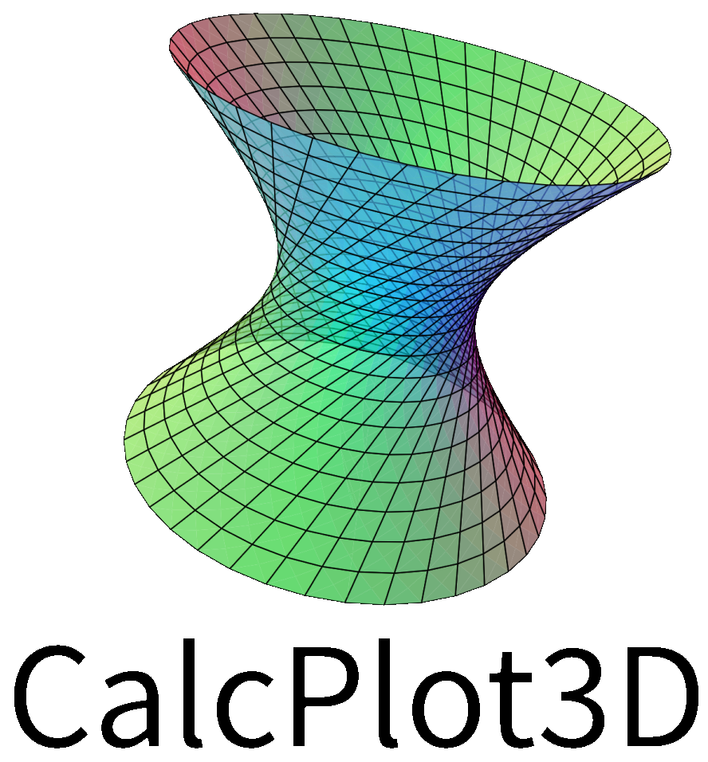

{width=30%}

I work with the CalcPlot3D project team on curriculum development and running professional development workshops associated with the free web-app [CalcPlot3D](https://c3d.libretexts.org/CalcPlot3D/index.html) and the [3D printed models](https://sites.monroecc.edu/multivariablecalculus/3d-learning-activities/) it can produce.

We are currently working under the [IMPACT-CalcPlot3D](https://www.nsf.gov/awardsearch/show-award?AWD_ID=2439708) NSF grant.

To stay current with the CalcPlot3D community, you can sign up for our [newsletter](https://calcplot3d.substack.com/).