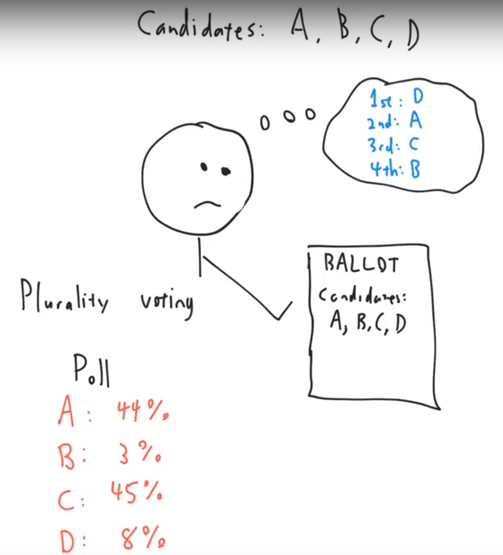

{width=60%}

In the summer of 2021, I worked on revamping NC State's MA 103: Topics in Contemporary Mathematics, a mathematics course for non-STEM majors. I designed the course with the philosophy that it should focus on applications of mathematics that:

1. Use mathematics outside of the algebra-precalculus-calculus stream,
2. Will be new to most students, and 
3. Have seen significant innovations in the last century or so

The course now covers topics in voting theory, network analysis, and cryptography, highlighting common threads in how innovations in mathematics are applied in the real world.

This course serves an important role as the last math course that many non-mathematically-inclined students take, with the potential to shape these students’ attitudes towards mathematics (and the attitudes they may pass down to their children). With support from the department and mini-grants from DELTA, the Libraries, DASA, and OAA, I made sweeping changes to the course intended to highlight compelling applications of mathematics for students outside of STEM fields by recording a new set of video lectures for distance education courses, adapting an open-source textbook, and creating online problem sets on a free platform (saving our students tens of thousands of dollars a year), and implementing a peer-grading system for written homework problems. These curricular materials are being used and will continue to be used and improved by other instructors for the course.

I've posted sample videos from the course on [Dijkstra's Algorithm](https://www.youtube.com/watch?v=M6xeVOWaSUw) and [Banzhaf Power Index](https://www.youtube.com/watch?v=CU0-kzWSowU) on YouTube.  Other [course videos](https://ncsu.hosted.panopto.com/Panopto/Pages/Sessions/List.aspx?folderID=cbd66a54-7595-4797-81ca-ad35013ffd9c) can be viewed by those with an NC State Unity ID.