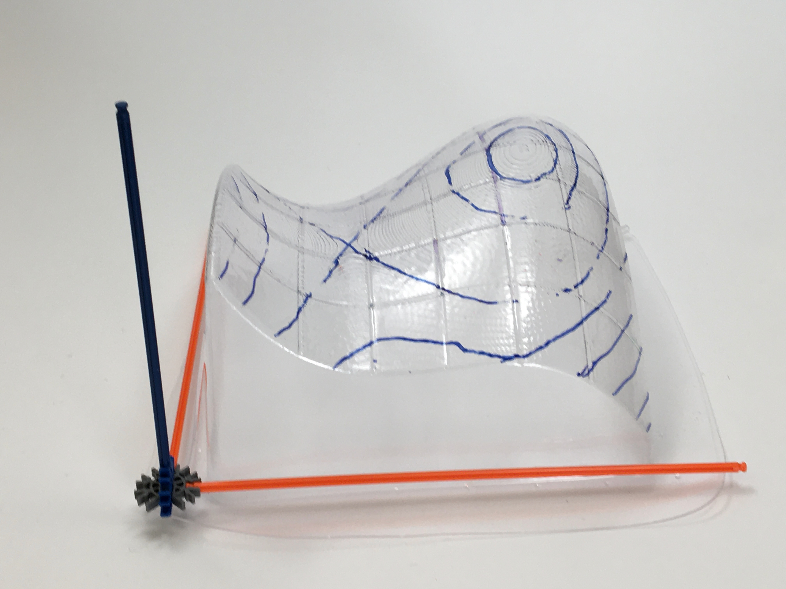

{width=60%}

While working as a Preceptor at Harvard University, I co-led the [Manipulative Calculus](https://www.manipulativecalculus.com/home) project Dr. Janet Chen on a project to create physical manipulatives for active learning lessons in multivariable and integral calculus.

At Harvard, The models have been in use since 2019 in Math 21a (multivariable calculus) and used by thousands of students. The course materials have been adopted and adapted at several other institutions as well.

