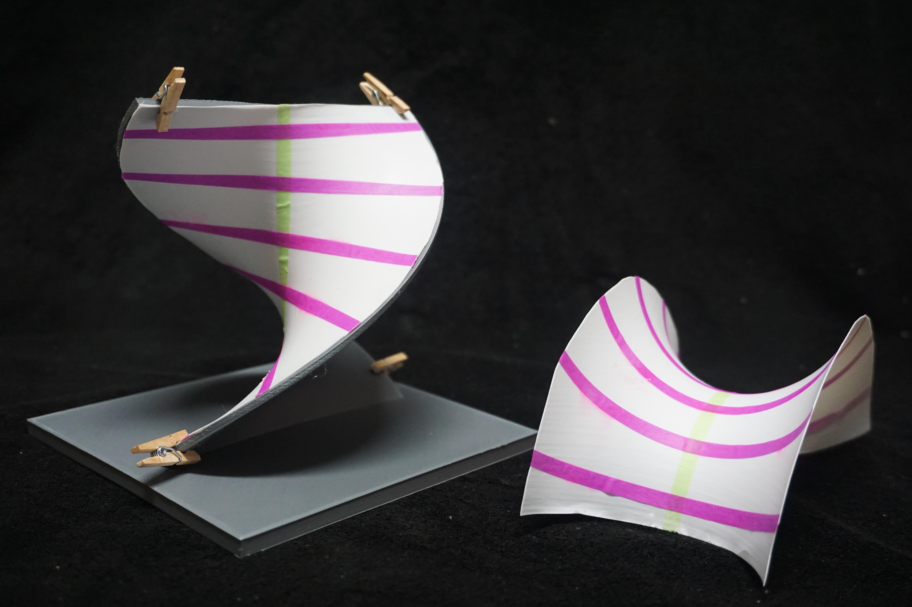

{width=60%}

I make non-Euclidean “paper” by thermoforming sheets of plastic onto 3D printed surfaces. I focus on the potential of these models as teaching tools for studying non-Euclidean geometry and differential geometry. The ones shown above were part of my contribution to the *Warped Realities: The Art of Differential Geometry* exhibit at the National Museum of Mathematics Composite Gallery as part of the  exhibition in Summer 2025.

- [Project Page](https://docs.google.com/document/d/1JpTlJ6FK2Z_unp1sPWfYdXH3kYHhy83vFqJYCthSmvg/edit?usp=sharing)
- [Video](https://youtu.be/W_joOY-9JZI) from the *Warped Realities* exhibit
- [Bridges article](https://archive.bridgesmathart.org/2023/bridges2023-219.html#gsc.tab=0)
- [3D Print Files](https://drive.google.com/drive/folders/1l3LQO6fSB7f14ROxsqwDSmhuSWcqritd)
