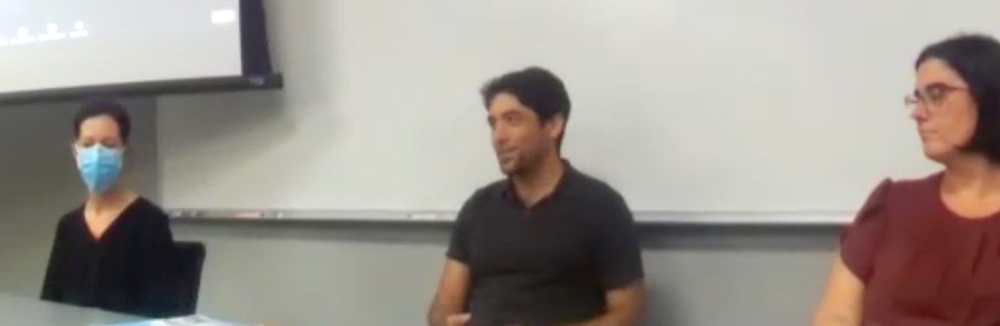

{width=80%}

I started the NC State Mathematics Department's Teaching and Learning Seminar in 2022, and we have had dozens of speakers and panels since then. In the 2025-2026, I am co-organizing the seminar with Rachel Abel.

Recorded sessions and slides can be found on [here](https://docs.google.com/spreadsheets/d/1LmeibB_qBatFWBYtuazPiwxrBL77oTyirWyPIAfYVpw/edit?gid=0#gid=0).

If you are interested in speaking or suggesting a speaker, please send me an [email](mailto:sspaul2@ncsu.edu)!

